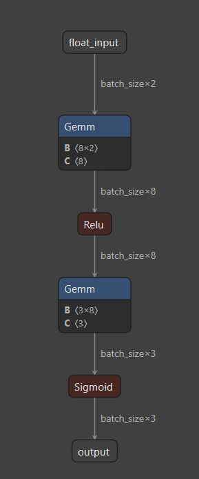

# Introduction

This project implements a neural network that simultaneously predicts the results of AND, OR and XOR logic operations for 2-bit binary inputs.

# Flavors

There are several versions:
- Standard (baseline):
  - Workflow: Pytorch for training, ONNX for inference
  - Target devices: workstation CPU, workstation GPU, KV260 CPU
- DPU (Quantized):
  - Workflow: Pytorch for training, Vitis AI for quantization / optimization, ONNX for inference
  - Target devices: workstation CPU, workstation GPU, KV260 CPU, KV260 PL (DPU)
- Custom PL:
  - Workflow: NN directly coded in RTL (SystemVerilog) or Vitis HLS, custom deploy on PL (interaction via Pynq/XRT?)
  - Target devices: KV260 PL

# AI architecture

MLP (Multi-Layer Perceptron):
- Input layer: 2 neurons (for 2-bit binary inputs)
- Hidden layer: 8 neurons with ReLU activation
- Output layer: 3 neurons with Sigmoid activation (for AND, OR, XOR predictions). Range: [0, 1] for each logic operation

Diagram:



# Hardware setup

See [README in main branch](https://github.com/juanma-rm/kv260_ai_projects/blob/main/README.md)

# General setup

For Windows PowerShell: enable execution policy:
```PowerShell
Set-ExecutionPolicy -ExecutionPolicy RemoteSigned -Scope CurrentUser
```

Create and activate virtual environment:
```
python -m venv .venv
.\.venv\Scripts\Activate.ps1
```

Install dependency modules:
```
pip install torch
pip install numpy
pip install matplotlib
pip install seaborn
pip install onnx
pip install onnxruntime
```

Install Blackwell-ready PyTorch:
```
pip install --pre torch torchvision torchaudio --index-url https://download.pytorch.org/whl/nightly/cu128

# Verify Pytorch installation and GPU detection
python -c "import torch; print(f'CUDA available: {torch.cuda.is_available()} | Device: {torch.cuda.get_device_name(0)}')"

# Expected output:
CUDA available: True | Device: NVIDIA GeForce RTX 5070 Ti
```

Install Jupyter and the IPyKernel bridge:
```
pip install jupyter ipykernel

# Add your venv as a selectable kernel in Jupyter
# This creates a "Python (AI-FPGA)" option in the Jupyter menu
python -m ipykernel install --user --name=ai_fpga --display-name "Python (AI-FPGA)"

# Launch Jupyter Lab
jupyter lab
```

# Run standard

```
cd sw\standard
# Train:
# Run notebook logic_ops_train.ipynb

# Inference
python logic_ops_inference.py --device CPU
python logic_ops_inference.py --device GPU
```

# Results

Notes:
- Dataset: 100000 samples
- Iterations per Batch Size: 20000
- Data is continually wrapped around a 100000-sample pool.
- Latency is measured for each batch, not per sample.

## Standard. Workstation: CPU

| Batch Size | Accuracy | Throughput (ksamp/s) | Latency Mean (ms) | Latency Min (ms) | Latency Median (ms) | Latency p95 (ms) | Latency p99 (ms) | Latency Max (ms) |
| :--- | :--- | :--- | :--- | :--- | :--- | :--- | :--- | :--- |
| 1 | 100.00% | 168.80 | 0.0059 | 0.0055 | 0.0058 | 0.0074 | 0.0080 | 0.1982 |
| 8 | 100.00% | 1351.96 | 0.0059 | 0.0057 | 0.0058 | 0.0060 | 0.0081 | 0.0720 |
| 64 | 100.00% | 10093.75 | 0.0063 | 0.0060 | 0.0062 | 0.0065 | 0.0088 | 0.0713 |
| 512 | 100.00% | 57260.83 | 0.0089 | 0.0084 | 0.0087 | 0.0094 | 0.0122 | 0.1078 |
| 2048 | 100.00% | 113958.31 | 0.0180 | 0.0169 | 0.0174 | 0.0193 | 0.0309 | 0.1177 |
| 16384 | 100.00% | 233064.39 | 0.0703 | 0.0560 | 0.0639 | 0.0968 | 0.1212 | 0.9619 |

## Standard. Workstation: GPU

| Batch Size | Accuracy | Throughput (ksamp/s) | Latency Mean (ms) | Latency Min (ms) | Latency Median (ms) | Latency p95 (ms) | Latency p99 (ms) | Latency Max (ms) |
| :--- | :--- | :--- | :--- | :--- | :--- | :--- | :--- | :--- |
| 1 | 100.00% | 168.13 | 0.0059 | 0.0057 | 0.0058 | 0.0060 | 0.0082 | 0.2007 |
| 8 | 100.00% | 1331.76 | 0.0060 | 0.0057 | 0.0059 | 0.0060 | 0.0076 | 0.0733 |
| 64 | 100.00% | 9509.84 | 0.0067 | 0.0061 | 0.0063 | 0.0067 | 0.0097 | 0.3711 |
| 512 | 100.00% | 56601.79 | 0.0090 | 0.0085 | 0.0088 | 0.0094 | 0.0124 | 0.0856 |
| 2048 | 100.00% | 113918.88 | 0.0180 | 0.0171 | 0.0175 | 0.0192 | 0.0251 | 0.1138 |
| 16384 | 100.00% | 234336.44 | 0.0699 | 0.0562 | 0.0635 | 0.0963 | 0.1198 | 0.4904 |

## Standard. KV260: CPU

| Batch Size | Accuracy | Throughput (ksamp/s) | Latency Mean (ms) | Latency Min (ms) | Latency Median (ms) | Latency p95 (ms) | Latency p99 (ms) | Latency Max (ms) |
| :--- | :--- | :--- | :--- | :--- | :--- | :--- | :--- | :--- |
| 1 | 100.00% | 10.75 | 0.0930 | 0.0910 | 0.0925 | 0.0937 | 0.1062 | 1.4950 |
| 8 | 100.00% | 84.79 | 0.0943 | 0.0924 | 0.0938 | 0.0953 | 0.1079 | 0.3456 |
| 64 | 100.00% | 608.69 | 0.1051 | 0.1028 | 0.1044 | 0.1066 | 0.1188 | 0.3705 |
| 512 | 100.00% | 2816.13 | 0.1818 | 0.1778 | 0.1805 | 0.1928 | 0.2004 | 0.4830 |
| 2048 | 100.00% | 4526.54 | 0.4524 | 0.4372 | 0.4471 | 0.4770 | 0.5368 | 0.8139 |
| 16384 | 100.00% | 7812.32 | 2.0972 | 2.0111 | 2.0888 | 2.1646 | 2.2927 | 12.4903 |